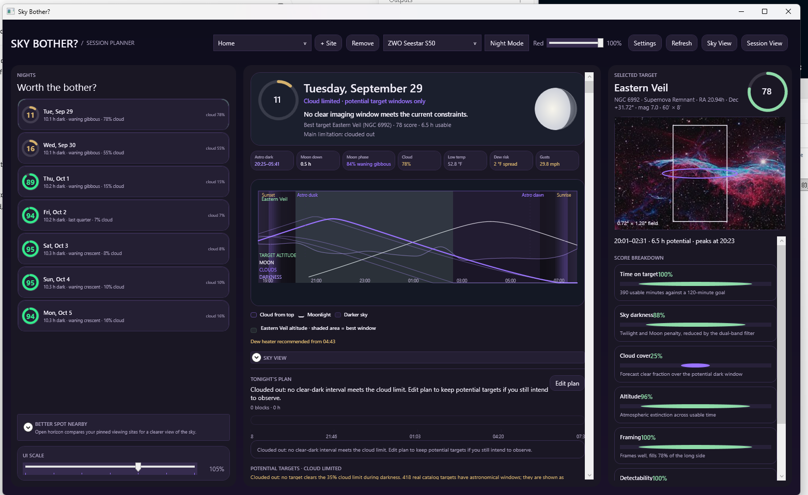
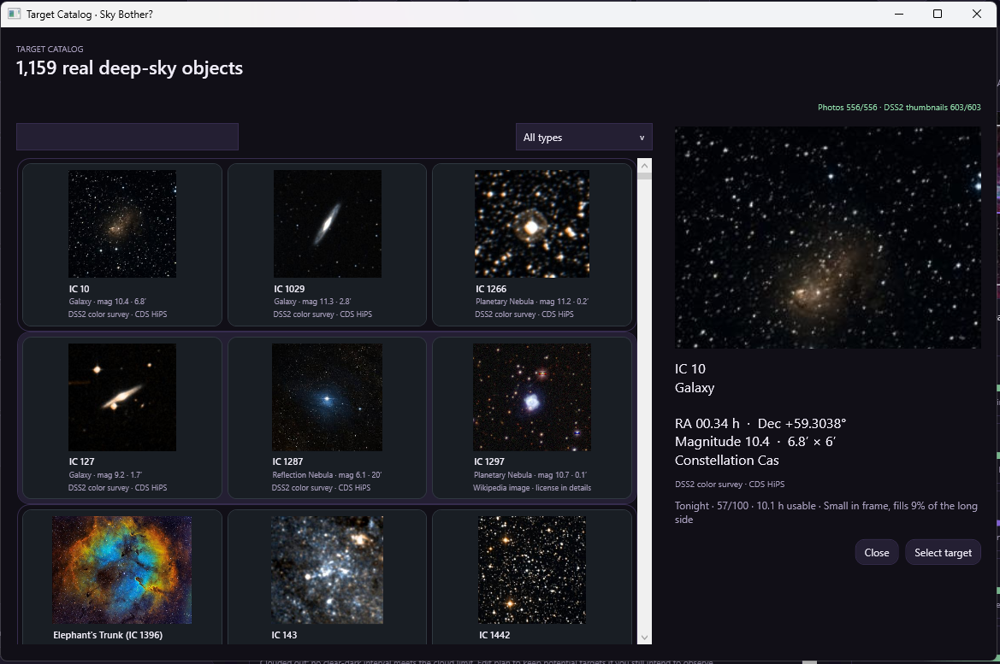
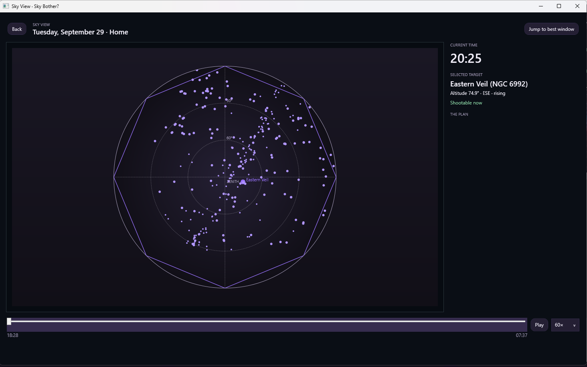
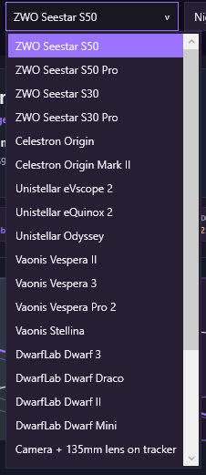

# Sky Bother for Windows — v0.1.0 User Guide

## Pre-comet edition

A practical guide to planning an observing night, setting up your site and equipment, understanding recommendations, and using the observing schedule.

**This guide is for the preserved v0.1.0 Windows release. Comet lookup and comet-coordinate validation are not included in this edition.** The package version is v0.1.0; the preserved executable may show older internal version metadata.

**Quick start:** Extract the whole ZIP, open SkyBother.exe, choose your site and equipment, click Refresh, select a night, then select a target.

> **REQUIRED FIRST STEP: Add or update your SITE LOCATION before using observing recommendations.** A site named **Home** is only a saved label; it does not confirm that the coordinates are yours. Use **+ Site** to enter and confirm your actual observing location, save it, and select it in the toolbar. Verify latitude, longitude, elevation, and time zone, then click **Refresh**. Repeat this check whenever you observe from a different location.

## Contents

1. Install, update, and keep your settings
2. Your first observing session
3. Main screen and toolbar
4. Observing sites and nearby spots
5. Equipment profiles
6. Nights, scores, conditions, and the timeline
7. Targets, catalog, and framing
8. Edit plan, Sky View, and Session View
9. Display settings and saved data
10. Troubleshooting
11. Astronomy terms
12. Credits
## Screenshots — v0.1.0

### Main planner

Choose your site and equipment, compare nights on the left, and inspect the selected target on the right. This example is **cloud limited**: potential target windows do not mean clear weather is forecast.

### Target catalog

Browse the deep-sky catalog, search or filter by type, and select a target to see its coordinates, size, and planning information. Pictures are reference images, not a live telescope view.

### Sky View

Move the time slider or press **Play** to preview the sky during the selected night. **Jump to best window** helps locate the preferred interval. The displayed time and status belong to the preview; check the planner's weather warnings separately.

### Equipment selector

Select the preset matching your setup, then check its values in **Settings → Equipment**. Equipment profiles support planning and framing; choosing one does not connect to or control the telescope.

## 1. Install, update, and keep your settings

### First installation

1. Download **SkyBother-v0.1.0-Windows-PreComet-With-Guide.zip** from the Windows v0.1.0 release on GitHub.
2. Use **Extract All** in Windows. Open the extracted folder rather than running the application inside the ZIP.
3. Keep `SkyBother.exe`, `Catalog`, `Data` when included, and the accompanying documents together. Moving only the executable can leave the app without its catalogs and pictures.
4. Open `SkyBother.exe`. The published Windows x64 package is self-contained, so a separate .NET installation is not required for that package.

### Updating from an older version

1. Close Sky Bother.
2. Back up `%AppData%\SkyBother` before changing versions. If that folder does not exist, you may not have saved settings yet.
3. Extract the new release into a new folder. Keeping versions in separate folders makes it easier to return to the previous application.
4. Start the new folder's `SkyBother.exe`. Check the selected site and equipment, then refresh the data.
5. Update any desktop shortcut to point to the new executable.

Application versions may share the same settings location. A separate application folder is not a separate settings profile. Keep a backup before changing versions. This release workflow uses manual downloads and extraction; there is no automatic application updater described here.

## 2. Your first observing session

1. Click **+ Site**. Search for your town, enter coordinates, or use **Use current location**. Confirm the location, set its Bortle class and blocked horizon, and save it.
2. Select that site in the toolbar.
3. Select your telescope/equipment profile. Use **Settings → Equipment** to check its values.
4. Click **Refresh** and let the forecast and nightly calculations finish.
5. Select a night in the left column. Read its verdict, best imaging window, and weather status.
6. Select a recommended target. Check its usable time, framing, score breakdown, and warnings.
7. Open **Edit plan** to adjust the suggested schedule. Click **Done** to keep your changes.
8. Open **Sky View** to preview target positions over the night. Use **Session View** during the observing session to follow the current and upcoming blocks.

## 3. Main screen and toolbar

| Control or area | What it does |
| --- | --- |
| Site selector | Chooses the observing location used for the calculations. |
| **+ Site** | Opens the observing-site editor to add a location. |
| **Remove** | Removes the selected saved site; read the confirmation before proceeding. |
| Equipment selector | Chooses the imaging profile used for framing and equipment-related calculations. |
| **Night Mode** | Applies a red, darker theme. **Ctrl+Shift+N** also toggles it. |
| **Settings** | Opens display units, equipment profiles, and the deep-sky catalog. |
| **Refresh** | Updates forecast data and observing calculations. |
| Selected-target panel | Shows target information, framing, scores, and warnings. |
| **Red** slider | Adjusts Night Mode intensity. |
| **Sky View** | Opens a time-based sky preview for the selected night and deep-sky targets. |
| **Session View** | Opens the observing schedule display with the current block, remaining time, conditions, and later blocks. |
| Left column | Saved-site summary, available nights, nearby-site comparison, spot evaluation, and UI scale. |
| Center column | Selected-night summary, conditions, timeline, sky preview, tonight's plan, and target results. |

## 4. Observing sites and nearby spots

### Set an accurate location

The site editor provides **Search places**, coordinate fields, and **Use current location**. A place-name search returns possible matches: select the correct result rather than assuming the first result is your observing spot.

Latitude and longitude use decimal degrees. North/east are positive; south/west are negative. **Site elevation** is height above sea level; it is different from a target's altitude above the horizon.

Automatic computer location is an estimate. In the confirmation map, check the pin, click the map or edit coordinates as needed, use **Update pin**, and then **Confirm location**. If location access fails, enter coordinates manually. Check the site's time-zone information as well, especially if the observing site is far from your computer.

### Light pollution and obstacles

- **Bortle class:** describes light pollution, from 1 (darkest) to 9 (brightest). It affects modeled target suitability. Choose a realistic value for the site.
- **Blocked horizon:** the height, in degrees above a flat horizon, of obstructions in all directions. A larger value excludes more low targets. This field does not measure your trees or buildings automatically.
- **Nominal setup reference:** the polar-axis elevation/direction shown in the site summary is a reference based on latitude. It is not a measurement of your mount's alignment error.

### Better Spot Nearby

This area compares your other saved/pinned sites with the selected site. Add more observing sites if the list says none have been pinned.

Use **Open horizon**, **Low horizon**, or **Any horizon**, along with the distance buttons, to narrow the comparison. Distances follow your display-unit setting. The comparison depends on the stored site information; it is not a live survey of all possible observing locations.

### Evaluate Spot

Enter `latitude, longitude`, choose **Use selected site**, or choose **Use current location**, then click **Check**. The app requests map-based information to estimate the spot's horizon. This can take time and requires internet access. Map links let you inspect the area. Treat the result as an estimate: verify obstacles and whether you can actually use the location.

## 5. Equipment profiles

Choose a preset from the equipment selector, then use **Settings → Equipment** if you need to adjust it. Check the profile against your actual configuration, including any reducer, camera, or filter changes.

| Field | Meaning |
| --- | --- |
| **Profile name** | A name you can recognize later. |
| **Aperture (mm)** | Diameter of the telescope or lens opening. |
| **Focal length (mm)** | Effective focal length of your setup. |
| **Sensor width / height (mm)** | Physical sensor dimensions used for the field-of-view calculation. |
| **Pixel size (µm)** | Pixel size used to calculate image scale. |
| **Mount** | Alt-azimuth or equatorial; affects field-rotation considerations. |
| **Zenith avoidance altitude (°)** | Altitude associated with near-overhead warnings for applicable equipment. |
| **Dual-band filter** | Indicates the modeled filter capability for suitable targets. |
| **Supports automatic mosaic** | Indicates whether the setup can accommodate targets needing multiple panels. |

Click **Save profile** to keep changes. These values inform planning; they do not command the telescope, switch a physical filter, or start a mosaic.

## 6. Nights, scores, conditions, and the timeline

### Choose a night

The **NIGHTS** column lists the computed observing nights. Click one to update the center panel. Times generally use the observing site's time zone. An observing night crosses midnight; before sunrise, the active night may carry the previous evening's date.

### What the scores mean

Scores are modeled planning ratings on a 0–100 scale, not probabilities of successful observation. Higher generally means more favorable modeled conditions.

The **night score** combines clear dark time, sky clarity, Moon interference, and conditions such as dew spread and gusts. A **target score** also considers time on target, sky darkness, cloud cover, altitude, framing, and detectability. The target's **Score Breakdown** explains the individual factors.

The night verdict uses these bands: **70 and above: Strong night**; **45–69: Mixed night**; **below 45: Thin night**. Cloud-limited and forecast-unavailable messages can take priority over these labels.

**A dash (—) is not a score of zero.** Without a forecast covering the full night, the app withholds weather-dependent scores and shows an astronomy-only view. A target may still be geometrically available without being a clear-weather recommendation.

### Conditions at a glance

- **Astro dark:** the astronomical-darkness interval or available dark hours.
- **Moon down:** dark time with the Moon below the horizon.
- **Moon phase / illumination:** the phase and percentage of the Moon lit by the Sun.
- **Cloud:** forecast cloud cover during dark hours; lower is generally preferable.
- **Temperature and gusts:** forecast conditions to consider when setting up.
- **Dew advice:** a forecast-based assessment using temperature/dew-point spread and wind. Messages such as **Dew watch**, **Dew heater recommended**, and **Dew looks manageable** are planning guidance. Missing forecast data can hide this advice.

### Read the timeline

Time runs from left to right through the selected night. **Cloud from top** means the cloud layer paints downward from the chart's upper edge. **Darker sky** refers to the background darkening as twilight fades. The Moon curve shows its changing altitude; the selected target has an altitude curve and a shaded best window. Other target curves can appear for comparison.

Use the legend labels rather than relying only on color, especially in Night Mode. Hover over a legend item for its explanation. The chart combines different quantities; a cloud layer is not an altitude measurement.

**Best imaging window** is the planner's preferred interval under its inputs and constraints. **Usable time** is the combined time satisfying the applicable criteria, which can include more than one interval. A target's highest point and its best imaging moment need not be identical.

When the screen says **POTENTIAL TARGETS · CLOUD LIMITED**, the targets have astronomical windows but fail the normal cloud criterion. Do not interpret those rows as a clear-sky forecast.

## 7. Targets, catalog, and framing

### Recommended list

Search by designation or name. Use the type filter to narrow the list and the sort selector to compare relevance, score, duration, or name as offered in the app.

The main deep-sky list is filtered by the chosen night and recommendation criteria and displays at most 200 matches. It is not the whole catalog. If nothing appears, clear the search/type filter, check the site and date, and read the status line.

### Full catalog

Open **Settings → Catalog** to browse the bundled deep-sky catalog. Search designations, common names, types, or constellations. Select a card to inspect its coordinates, magnitude, angular size, constellation, image attribution, and fit for the selected night; use **Select target** to bring it back to the planner.

Catalog inclusion does not guarantee visibility tonight. A catalog image is a reference image, not a live view through your telescope.

### Selected target

Check the target name/designation, right ascension and declination, magnitude, angular size, best window, usable duration, and warnings. The framing display uses the selected equipment's field of view to help judge whether the target fits or needs a mosaic. It is a planning illustration, not a plate-solved camera view.

Warnings can flag limited framing, low surface brightness, or alt-azimuth field rotation. A missing picture means no suitable bundled image is available; it does not necessarily mean the target data failed to load.

## 8. Edit plan, Sky View, and Session View

### Tonight's Plan and Edit Plan

The planner can suggest target blocks. Click a block to inspect/select its target, or open **Edit plan** to change the schedule.

| Editor control | Action |
| --- | --- |
| Select a block | Chooses which block the editing actions affect. |
| **Earlier / Later** | Moves the selected block in 15-minute steps, subject to schedule limits. |
| **−15 min / +15 min** | Shortens or lengthens the block, subject to schedule limits. |
| **Remove** | Removes the selected block from this plan. |
| Target picker + **Add to plan** | Adds a deep-sky catalog target to an available stretch. |
| **Use nightly suggestion** | Replaces the manual arrangement with the suggested plan. |
| **Done** | Keeps the edited plan. |
| **Cancel** | Discards changes made in the editor. |

Blocks cannot overlap. If an adjustment will not fit, check neighboring blocks and the night boundaries. Unusable portions of a block remain visible rather than silently disappearing; read the warnings before relying on the schedule.

### Sky View

Open **Sky View** after choosing a night. Move the time slider to inspect the sky at different moments. **Play/Pause** animates the preview, and the speed selector changes playback speed. **Jump to best window** moves to the preferred target interval. Select a plan entry to inspect its target. **Back** returns from this view.

The position/status area can report **Shootable now**, **Blocked**, **Not dark enough now**, or **Not in a usable target window**. “Now” here refers to the preview's displayed time, which can differ from the real clock.

### Session View

This view follows the real clock against the selected night's plan. It shows the current or next target, scheduled times, remaining time, conditions, and **What's Next**. **No active block** can mean you are between blocks or before the plan; **Plan complete** means the scheduled blocks have ended. Use **Planner** to return.

Reopen these views after changing the underlying plan/night if you need the latest schedule. They receive the plan when opened.

## 9. Display settings and saved data

**Settings → Display units** switches between Metric and US customary. This changes displayed measurements, not the underlying calculations. Equipment fields retain the units printed beside them.

**UI Scale** changes the main screen's content size. Reduce it if content feels crowded; maximize the window and use the panels' scrollbars to reach additional content. **Night Mode** and its red-intensity control are saved between runs.

Sites, equipment profiles, display choices, and plans are stored under `%AppData%\SkyBother`. Back up this folder before updating.

## 10. Troubleshooting

| Symptom | Check or action |
| --- | --- |
| Scores show **—** | The night lacks complete forecast coverage. Astronomy-only results can still be available. |
| Cloud-limited targets appear | They show potential astronomical windows, not a promise of clear conditions. |
| No deep-sky targets appear | Clear filters, inspect horizon/site/equipment constraints, and open the full Catalog. |
| Pictures or catalogs are missing | Re-extract the complete release; keep `Catalog` and `Data` beside the executable. |
| Computer location is wrong | Correct the map pin or enter exact coordinates manually. |
| Nearby list is empty | Add other saved sites or broaden the radius/horizon filter. |
| Plan block will not move or grow | Check for overlapping blocks and the boundaries of the night. |
| Session View says no active block | Check the real clock, selected night, and scheduled block times. |
| An older version opens | Update the shortcut and launch the executable from the new release folder. |
| Online features fail | Check the connection and the error message; a service can be temporarily unavailable. Retry later. |

When reporting a problem, include the application version, exact message, selected date, relevant equipment/settings, and the steps that led to it. Include location only at the precision needed to reproduce the issue; a screenshot can contain your saved home coordinates.

## 11. Astronomy terms

| Term | Plain-language meaning |
| --- | --- |
| Altitude | Height in the sky: 0° at the horizon and 90° overhead. |
| Azimuth | Direction around the horizon: 0° north, 90° east, 180° south, 270° west. |
| RA / Dec | Right ascension and declination: a celestial coordinate pair. RA is often displayed in hours; Dec in degrees. |
| Ephemeris | A calculated position, or series of positions, for specified times. |
| Topocentric | Calculated for an observer at a particular location on Earth. |
| Transit | Passage near a target's highest daily position across the local meridian. |
| Magnitude | A brightness scale on which smaller numbers mean brighter objects. |
| Surface brightness | How an object's light is spread across its apparent area. |
| Arcminute / arcsecond | Angular units: 60 arcminutes per degree and 60 arcseconds per arcminute. |
| Field of view | How much sky fits in the camera or viewing area. |
| Mosaic | Multiple overlapping image panels covering a larger area. |
| Zenith | The point directly overhead. |
| Field rotation | Rotation of the sky's orientation relative to the camera during tracking, relevant to alt-azimuth imaging. |
| Dew-point spread | The difference between air temperature and dew point; a smaller gap can indicate greater condensation risk. |

## 12. Credits

The original **Sky Bother for macOS** was created by **WrendorWC**. This Windows adaptation is based on their work.

**Original project:** [WrendorWC/sky-bother](https://github.com/WrendorWC/sky-bother)

Original copyright and license notices are included in LICENSE. See CATALOG-LICENSE.md for catalog and image attribution.

