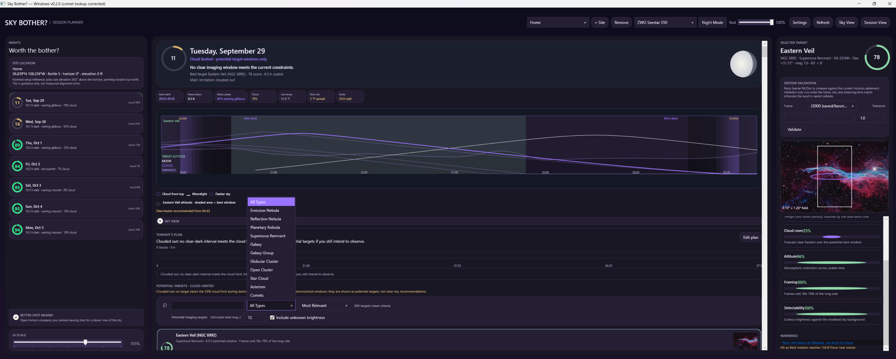
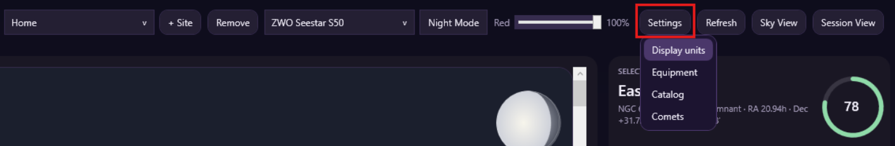
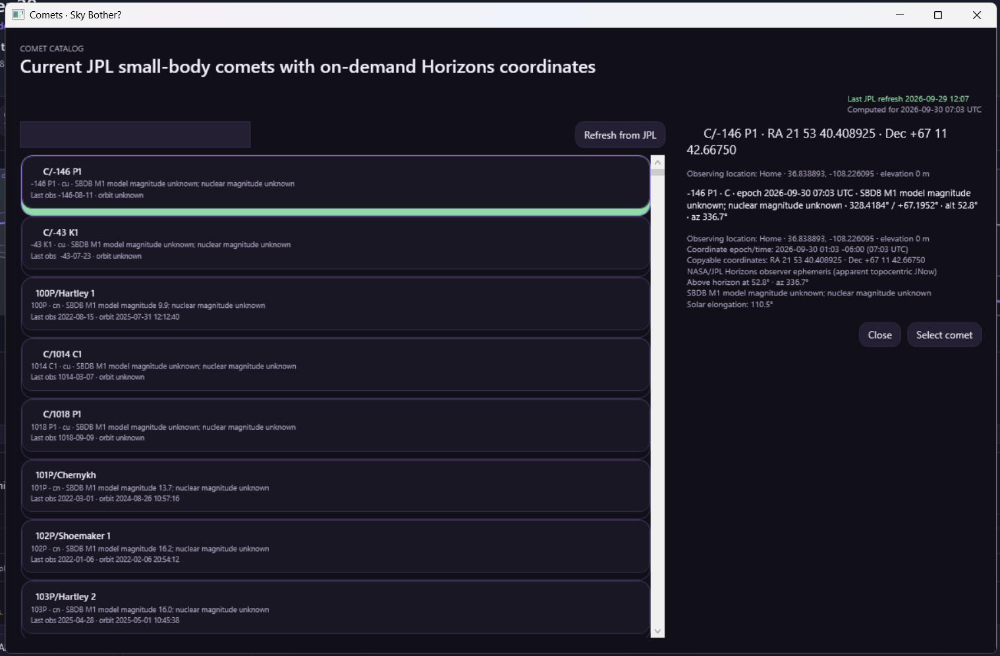
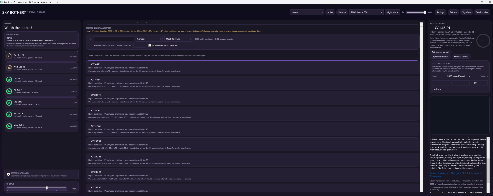

# Sky Bother for Windows

## User guide · v0.2.0 Comet Edition

Plan an observing night, compare targets, preview the sky, and look up comet coordinates for your observing location.

**Start here:** select your site and equipment, click **Refresh**, choose a night, then select a target. For comets, read **Section 9** before starting a lookup.

> **Comets can take time to appear.** When the main list says **“Filtering comets…”**, the app is checking JPL candidates in the background. The raw **Night candidates** list appears first, then the smaller **Potential imaging targets** shortlist is filtered locally from those results. A blank list during this stage does not, by itself, mean the app is broken. There is currently no progress counter or reliable completion estimate.

This guide describes the Windows source reviewed on September 29, 2026 for the v0.2.0 release. It does not describe every feature of the separate macOS app. The comet sections do not apply to the pre-comet v0.1.0 release.

> **REQUIRED FIRST STEP: Add or update your SITE LOCATION before validating coordinates or using observing recommendations.** A site named **Home** is only a saved label; it does not confirm that the coordinates are yours. Use **+ Site** to enter and confirm your actual observing location, save it, and select it in the toolbar. Verify latitude, longitude, elevation, and time zone, then click **Refresh**. Repeat this check whenever you observe from a different location.

## Contents

1. Install, update, and keep your settings
2. Your first observing session
3. Main screen and toolbar
4. Observing sites and nearby spots
5. Equipment profiles
6. Nights, scores, conditions, and the timeline
7. Targets, catalog, and framing
8. Edit plan, Sky View, and Session View
9. Comet lookup and the waiting period
10. Comet coordinates and Seestar validation
11. Display settings and saved data
12. Troubleshooting
13. Astronomy terms
14. Credits

## Screenshots — v0.2.0 Comet Edition

### Choose Comets in the planner

Choose **Comets** from the target-type menu to request night candidates for the selected site and observing night. The planner also retains its deep-sky targets, weather timeline, and equipment profiles.

### Open the comet catalog

Use **Settings → Comets** to browse or search the comet catalog directly, including when a known object is absent from the imaging shortlist.

### Inspect a selected comet

Search by name or designation, then select an entry to request its Horizons coordinates. Check the displayed observation time and coordinate frame. **Refresh from JPL** updates the catalog. Catalog membership alone does not establish that a comet is a practical observing target, and SBDB M1 is a model parameter rather than current apparent brightness.

### Night candidates and imaging filters

**Night candidates** are geometric opportunities returned by JPL. **Potential imaging targets** also pass the chosen total-magnitude filter. This example has **Include unknown brightness** enabled, so its large count includes objects whose total brightness is unknown; it is not a count of guaranteed telescope detections. Select an object for coordinates and observing guidance. Counts depend on the site, night, and filter settings.

## 1. Install, update, and keep your settings

### First installation

1. Download the Windows release ZIP. Choose **v0.2.0 Comets** for comet lookup; v0.1.0 is the earlier pre-comet release.
2. Use **Extract All** in Windows. Open the extracted folder rather than running the application inside the ZIP.
3. Keep `SkyBother.exe`, `Catalog`, `Data` when included, and the accompanying documents together. Moving only the executable can leave the app without its catalogs and pictures.
4. Open `SkyBother.exe`. The published Windows x64 package is self-contained, so a separate .NET installation is not required for that package.

Internet access is used for forecasts, place searches, map data, JPL catalog refreshes, comet visibility queries, and comet positions. Bundled catalog information is stored locally; that does not make all online features available offline.

### Updating from an older version

1. Close Sky Bother.
2. Press **Windows+R**, enter `%AppData%\SkyBother`, and copy that folder to a backup location. It contains your saved settings and may contain the comet catalog cache.
3. Extract the new release into a new folder. Keeping versions in separate folders makes it easier to return to the previous application.
4. Start the new folder's `SkyBother.exe`. Check the selected site and equipment, then refresh the data.
5. Update any desktop shortcut to point to the new executable.

Both application versions use the same settings location. A separate application folder is not a separate settings profile. Keep the backup if you intend to switch back to v0.1.0. This release workflow uses manual downloads and extraction; there is no automatic application updater described here.

## 2. Your first observing session

1. Click **+ Site**. Search for your town, enter coordinates, or use **Use current location**. Confirm the location, set its Bortle class and blocked horizon, and save it.
2. Select that site in the toolbar.
3. Select your telescope/equipment profile. Use **Settings → Equipment** to check its values.
4. Click **Refresh** and let the forecast and nightly calculations finish.
5. Select a night in the left column. Read its verdict, best imaging window, and weather status.
6. Select a recommended target. Check its usable time, framing, score breakdown, and warnings.
7. Open **Edit plan** to adjust the suggested schedule. Click **Done** to keep your changes.
8. Open **Sky View** to preview target positions over the night. Use **Session View** during the observing session to follow the current and upcoming blocks.

For a comet, choose between the visibility-filtered main list and the searchable catalog described in Section 9. Comet lookup is a separate workflow from the deep-sky session planner.

## 3. Main screen and toolbar

| Control or area | What it does |
| --- | --- |
| Site selector | Chooses the observing location used for the calculations. |
| **+ Site** | Opens the observing-site editor to add a location. |
| **Remove** | Removes the selected saved site; read the confirmation before proceeding. |
| Equipment selector | Chooses the imaging profile used for framing and equipment-related calculations. |
| **Night Mode** | Applies a red, darker theme. **Ctrl+Shift+N** also toggles it. |
| **Red** slider | Adjusts Night Mode intensity. |
| **Settings** | Opens **Display units**, **Equipment**, **Catalog**, and **Comets**. |
| **Refresh** | Refreshes the planner's forecast/calculations. It is distinct from **Refresh comets** and **Refresh ephemeris**. |
| **Sky View** | Opens a time-based sky preview for the selected night and deep-sky targets. |
| **Session View** | Opens the observing schedule display with the current block, remaining time, conditions, and later blocks. |
| Left column | Saved-site summary, available nights, nearby-site comparison, spot evaluation, and UI scale. |
| Center column | Selected-night summary, conditions, timeline, sky preview, tonight's plan, and target results. |
| Selected-target panel | Details, picture/framing where available, score factors, warnings, or comet coordinates and actions. |

Hover over chart legend items and controls with tooltips for additional explanations. Some controls only appear when a comet is selected or the Comets filter is active.

## 4. Observing sites and nearby spots

### Set an accurate location

The site editor provides **Search places**, coordinate fields, and **Use current location**. A place-name search returns possible matches: select the correct result rather than assuming the first result is your observing spot.

Latitude and longitude use decimal degrees. North/east are positive; south/west are negative. **Site elevation** is height above sea level; it is different from a target's altitude above the horizon.

Automatic computer location is an estimate. In the confirmation map, check the pin, click the map or edit coordinates as needed, use **Update pin**, and then **Confirm location**. If location access fails, enter coordinates manually. Check the site's time-zone information as well, especially if the observing site is far from your computer.

### Light pollution and obstacles

- **Bortle class:** describes light pollution, from 1 (darkest) to 9 (brightest). It affects modeled target suitability. Choose a realistic value for the site.
- **Blocked horizon:** the height, in degrees above a flat horizon, of obstructions in all directions. A larger value excludes more low targets. This field does not measure your trees or buildings automatically.
- **Nominal setup reference:** the polar-axis elevation/direction shown in the site summary is a reference based on latitude. It is not a measurement of your mount's alignment error.

### Better Spot Nearby

This area compares your other saved/pinned sites with the selected site. Add more observing sites if the list says none have been pinned.

Use **Open horizon**, **Low horizon**, or **Any horizon**, along with the distance buttons, to narrow the comparison. Distances follow your display-unit setting. The comparison depends on the stored site information; it is not a live survey of all possible observing locations.

### Evaluate Spot

Enter `latitude, longitude`, choose **Use selected site**, or choose **Use current location**, then click **Check**. The app requests map-based information to estimate the spot's horizon. This can take time and requires internet access. Map links let you inspect the area. Treat the result as an estimate: verify obstacles and whether you can actually use the location.

## 5. Equipment profiles

Choose a preset from the equipment selector, then use **Settings → Equipment** if you need to adjust it. Check the profile against your actual configuration, including any reducer, camera, or filter changes.

| Field | Meaning |
| --- | --- |
| **Profile name** | A name you can recognize later. |
| **Aperture (mm)** | Diameter of the telescope or lens opening. |
| **Focal length (mm)** | Effective focal length of your setup. |
| **Sensor width / height (mm)** | Physical sensor dimensions used for the field-of-view calculation. |
| **Pixel size (µm)** | Pixel size used to calculate image scale. |
| **Mount** | Alt-azimuth or equatorial; affects field-rotation considerations. |
| **Zenith avoidance altitude (°)** | Altitude associated with near-overhead warnings for applicable equipment. |
| **Dual-band filter** | Indicates the modeled filter capability for suitable targets. |
| **Supports automatic mosaic** | Indicates whether the setup can accommodate targets needing multiple panels. |

Click **Save profile** to keep changes. These values inform planning; they do not command the telescope, switch a physical filter, or start a mosaic.

## 6. Nights, scores, conditions, and the timeline

### Choose a night

The **NIGHTS** column lists the computed observing nights. Click one to update the center panel. Times generally use the observing site's time zone. An observing night crosses midnight; before sunrise, the active night may carry the previous evening's date.

### What the scores mean

Scores are modeled planning ratings on a 0–100 scale, not probabilities of successful observation. Higher generally means more favorable modeled conditions.

The **night score** combines clear dark time, sky clarity, Moon interference, and conditions such as dew spread and gusts. A **target score** also considers time on target, sky darkness, cloud cover, altitude, framing, and detectability. The target's **Score Breakdown** explains the individual factors.

The night verdict uses these bands: **70 and above: Strong night**; **45–69: Mixed night**; **below 45: Thin night**. Cloud-limited and forecast-unavailable messages can take priority over these labels.

**A dash (—) is not a score of zero.** Without a forecast covering the full night, the app withholds weather-dependent scores and shows an astronomy-only view. A target may still be geometrically available without being a clear-weather recommendation.

### Conditions at a glance

- **Astro dark:** the astronomical-darkness interval or available dark hours.
- **Moon down:** dark time with the Moon below the horizon.
- **Moon phase / illumination:** the phase and percentage of the Moon lit by the Sun.
- **Cloud:** forecast cloud cover during dark hours; lower is generally preferable.
- **Temperature and gusts:** forecast conditions to consider when setting up.
- **Dew advice:** a forecast-based assessment using temperature/dew-point spread and wind. Messages such as **Dew watch**, **Dew heater recommended**, and **Dew looks manageable** are planning guidance. Missing forecast data can hide this advice.

### Read the timeline

Time runs from left to right through the selected night. **Cloud from top** means the cloud layer paints downward from the chart's upper edge. **Darker sky** refers to the background darkening as twilight fades. The Moon curve shows its changing altitude; the selected target has an altitude curve and a shaded best window. Other target curves can appear for comparison.

Use the legend labels rather than relying only on color, especially in Night Mode. Hover over a legend item for its explanation. The chart combines different quantities; a cloud layer is not an altitude measurement.

**Best imaging window** is the planner's preferred interval under its inputs and constraints. **Usable time** is the combined time satisfying the applicable criteria, which can include more than one interval. A target's highest point and its best imaging moment need not be identical.

When the screen says **POTENTIAL TARGETS · CLOUD LIMITED**, the targets have astronomical windows but fail the normal cloud criterion. Do not interpret those rows as a clear-sky forecast.

## 7. Targets, catalog, and framing

### Recommended list

Use the search field to find a designation or name, the type selector to narrow object types, and the sort selector to compare **Most Relevant**, **Score**, **Duration**, or **Name**. These sorting choices apply to the deep-sky list. In the reviewed version, comet filter results are ordered by name even when the shared sort selector shows another choice.

The main deep-sky list is filtered by the chosen night and recommendation criteria and displays at most 200 matches. It is not the whole catalog. If nothing appears, clear the search/type filter, check the site and date, and read the status line.

### Full catalog

Open **Settings → Catalog** to browse the bundled deep-sky catalog. Search designations, common names, types, or constellations. Select a card to inspect its coordinates, magnitude, angular size, constellation, image attribution, and fit for the selected night; use **Select target** to bring it back to the planner.

Catalog inclusion does not guarantee visibility tonight. A catalog image is a reference image, not a live view through your telescope.

### Selected target

Check the target name/designation, right ascension and declination, magnitude, angular size, best window, usable duration, and warnings. The framing display uses the selected equipment's field of view to help judge whether the target fits or needs a mosaic. It is a planning illustration, not a plate-solved camera view.

Warnings can flag limited framing, low surface brightness, or alt-azimuth field rotation. A missing picture means no suitable bundled image is available; it does not necessarily mean the target data failed to load.

## 8. Edit plan, Sky View, and Session View

### Tonight's Plan and Edit Plan

The planner can suggest target blocks. Click a block to inspect/select its target, or open **Edit plan** to change the schedule.

| Editor control | Action |
| --- | --- |
| Select a block | Chooses which block the editing actions affect. |
| **Earlier / Later** | Moves the selected block in 15-minute steps, subject to schedule limits. |
| **−15 min / +15 min** | Shortens or lengthens the block, subject to schedule limits. |
| **Remove** | Removes the selected block from this plan. |
| Target picker + **Add to plan** | Adds a deep-sky catalog target to an available stretch. |
| **Use nightly suggestion** | Replaces the manual arrangement with the suggested plan. |
| **Done** | Keeps the edited plan. |
| **Cancel** | Discards changes made in the editor. |

Blocks cannot overlap. If an adjustment will not fit, check neighboring blocks and the night boundaries. Unusable portions of a block remain visible rather than silently disappearing; read the warnings before relying on the schedule.

### Sky View

Open **Sky View** after choosing a night. Move the time slider to inspect the sky at different moments. **Play/Pause** animates the preview, and the speed selector changes playback speed. **Jump to best window** moves to the preferred target interval. Select a plan entry to inspect its target. **Back** returns from this view.

The position/status area can report **Shootable now**, **Blocked**, **Not dark enough now**, or **Not in a usable target window**. “Now” here refers to the preview's displayed time, which can differ from the real clock.

### Session View

This view follows the real clock against the selected night's plan. It shows the current or next target, scheduled times, remaining time, conditions, and **What's Next**. **No active block** can mean you are between blocks or before the plan; **Plan complete** means the scheduled blocks have ended. Use **Planner** to return.

Reopen these views after changing the underlying plan/night if you need the latest schedule. They receive the plan when opened.

**Comet limitation in this version:** the plan editor, separate Sky View, and Session View use deep-sky catalog targets. Selecting a comet does not automatically add a moving-comet block to the schedule or provide a complete moving-comet track in those views. Use its dedicated coordinate details for comet work.

## 9. Comet lookup and the waiting period

### Route A — find candidates for your selected site and night

1. Select your actual observing site and click **Refresh** if no nights have been calculated.
2. Select the observing night.
3. Change the main target-type selector to **Comets**.
4. Read the two sections that appear: **Night candidates** shows the raw JPL observing candidates, and **Potential imaging targets** applies the adjustable total-magnitude filter.
5. Adjust the magnitude limit or toggle **Include Unknown** if you want a tighter or broader shortlist, then select a result to inspect its coordinates and time.

The app first asks JPL's Small-Body Observability service for candidates using the site's location, selected night, and minimum horizon elevation. It then uses the returned observing interval to separate raw night candidates from the smaller imaging shortlist. JPL marks total magnitudes with a trailing `T` and nuclear magnitudes with a trailing `N`; only confirmed total magnitudes count toward the shortlist unless **Include Unknown** is enabled. Horizons coordinates are fetched when you select a comet, not for every candidate up front.

### Why nothing appears immediately

The list now separates the raw JPL night candidates from the smaller imaging shortlist. The raw observing list appears first, and the imaging list is filtered locally from that result. Horizons coordinates are loaded only when you select a comet, so the app does not make thousands of coordinate requests before showing anything.

For example, **“Night candidates”** counts the objects returned for the selected observing night, while **“Potential imaging targets”** counts the objects that also pass the total-magnitude filter. The second number is a shortlist, not a telescope guarantee. Objects with no confirmed total magnitude only enter the shortlist if **Include Unknown** is enabled.

Changing the search, night, or imaging filter can update the list. If nothing appears, check the site, date, horizon, and filter settings before refreshing again.

### What each message means

| Message | Meaning and what to do |
| --- | --- |
| **Choose a site and calculate a night…** | Select a site and refresh the planner before using the visibility filter. |
| **Night candidates…** | JPL returned above-horizon observing candidates for the selected night. |
| **Potential imaging targets…** | The total-magnitude shortlist is being shown below the raw candidates. |
| **X night candidates / Y imaging targets** | The raw JPL list and the filtered imaging shortlist both completed. |
| **No night candidates… / 0 imaging targets** | No results survived the current checks. Verify the site, night, horizon, search text, and total-magnitude filter. |
| **Computing Horizons ephemeris…** | The app is requesting coordinates for the selected comet. |
| **Using bundled seed catalog** | The app is using the included catalog rather than a successfully refreshed JPL list. Live coordinate queries still need a connection. |
| **Last JPL refresh…** | The time the catalog was last successfully downloaded; it is not the time for every displayed position. |
| **Last refresh issue / timed out / network error** | An online request failed. Read the message, check connectivity, and retry later. |

### Route B — look up a particular comet directly

1. Open **Settings → Comets**.
2. Search the comet's name or designation.
3. Select its entry. The app requests that comet's coordinates on demand.
4. Inspect the location, computed time, coordinate frame, and altitude.
5. Click **Select comet** to show it in the main detail panel.

This catalog route does not perform the same all-candidate visibility filtering first. It can be more practical when you already know which comet you want. A catalog result may be below your horizon.

**Refresh from JPL** in the catalog and **Refresh comets** in the main view refresh the comet list. **Refresh ephemeris** refreshes the selected comet's calculated position. They serve different purposes.

### What “meets criteria” does and does not establish

A result indicates that a candidate passed the implemented location/date/horizon checks. It does **not** guarantee sufficient brightness, clear weather, unobstructed views in every direction, or suitability for your telescope. Comets are not given the same weather/equipment score as deep-sky targets.

An imaging telescope's ability to record a comet is a separate question from unaided-eye visibility. The current comet filter does not evaluate your particular exposure/stacking setup, alignment, or filter selection. Do not interpret its empty list as a claim that an S50 or another imaging telescope cannot capture a comet. A previous successful image establishes a useful observation to investigate, but its date and observing conditions still need to be matched when comparing it with a new lookup.

**Known result-message limitation:** if a coordinate lookup fails, the app reports the error separately from the valid night-candidate list. That outcome means the selected comet's coordinates are unavailable, not that the candidate itself vanished.

The night-candidate list is based on JPL's observing interval and the selected site's horizon. It is not a claim that every listed comet is easy to image with your setup. Read the displayed observing window, magnitude type, and coordinate time before deciding whether a comet is worth pursuing.

### If it seems stuck

Give the batch time to finish, then read any error message. A persistent “Filtering…” label alone cannot establish whether it is progressing or waiting on a request, because this build has no per-candidate progress display. Try the direct catalog route for a named comet when practical. If the wait persists, note the site, selected night, search text, and exact status, then close/reopen the app and retry once. Report repeat failures with those details rather than repeatedly refreshing.

## 10. Comet coordinates and Seestar validation

### Read the details before using coordinates

- **RA / Dec:** the comet's celestial position in the stated coordinate frame.
- **Coordinate frame:** the reference system, such as J2000 or apparent JNow. Values in different frames are not directly interchangeable.
- **Computed time / epoch:** the instant for the position. Comets move, so coordinates are time-dependent.
- **Observing location:** the latitude, longitude, and elevation used for the observer-specific calculation.
- **Altitude / elevation:** degrees above or below the horizon. Negative means below the horizon.
- **Azimuth:** compass direction expressed in degrees.
- **Total magnitude:** an estimate when supplied. Missing magnitude is unknown, not zero.
- **Nuclear magnitude:** a separate quantity when available. If it is not shown, the app does not invent one.
- **Visual magnitude:** the JPL value shown for a selected ephemeris point. Treat it as an estimate, not a promise.

**Important:** the app may choose a planning time from the selected night rather than the current clock time. Clicking **Refresh ephemeris** does not necessarily change the calculation to “right now.” Always inspect the displayed time and location before entering coordinates into another app.

**Copy coordinates** copies the designation, RA/Dec, frame, UTC time, location, and available altitude/azimuth information. It does not send a command to your telescope.

### Compare Seestar coordinates

**Before you click Validate, add or update your SITE LOCATION and select it in the toolbar.** Check the actual latitude, longitude, elevation, and time zone; do not assume the saved Home site is correct. Click **Refresh**, select the intended observing night, then select the comet and use **Refresh ephemeris**. Check that the resulting coordinates show your intended location and time. Only then compare them with Seestar coordinates for that same site, time, comet, and coordinate frame.

After changing the site, obtain a fresh reference position; do not validate against coordinates left over from the previous location.

1. Select a comet with a successful Horizons position.
2. Confirm that the coordinates you are comparing refer to the same comet, observing site, and time.
3. Choose the matching frame in **Seestar Validation**. The app offers **Unknown**, **J2000 (saved/favorite)**, and **JNow (object details)**. Confirm the actual frame used by your telescope app rather than relying on the label alone.
4. Enter RA and Dec. Prefer RA in `HH:MM:SS` and Dec in signed degree/minute/second form, such as `+12:34:56`, to avoid ambiguous decimal RA units.
5. Enter a positive tolerance in arcminutes; the displayed default is **1.0**.
6. Click **Validate**.

**Pass** means the entered coordinates are within the chosen angular tolerance of the reference. **Fail** means the difference exceeds that tolerance. **Cannot validate** means a required input/reference/frame is unavailable or invalid.

The app cannot independently read the site or timestamp belonging to coordinates pasted from Seestar. Even if the result says **“site/time matched,”** you must verify that match yourself. A pass is a numerical coordinate comparison, not confirmation that the telescope is physically pointing correctly or that the comet will be visible.

## 11. Display settings and saved data

**Settings → Display units** switches between Metric and US customary. This changes displayed measurements, not the underlying calculations. Equipment fields retain the units printed beside them.

**UI Scale** changes the main screen's content size. Reduce it if content feels crowded; maximize the window and use the panels' scrollbars to reach additional content. **Night Mode** and its red-intensity control are saved between runs.

Sites, equipment profiles, display choices, and manual session plans are stored in `%AppData%\SkyBother\settings.json`. The downloaded comet list can be stored as `comets-cache.json` in the same folder. A cached catalog is not a guarantee of offline Horizons positions.

## 12. Troubleshooting

| Symptom | Check or action |
| --- | --- |
| Comet list is blank with **Filtering…** | Allow the batch to finish; see Section 9. Avoid repeatedly changing filters. |
| A known comet is missing | Clear the search, check the selected site/night/horizon, and use **Settings → Comets** for a direct catalog lookup. |
| A comet is listed but cannot be seen | Check the coordinate time, altitude, magnitude, clouds, local obstacles, and telescope capability. |
| Coordinates disagree with another app | Match designation, date/time, location, frame, and RA units first. |
| **Cannot validate** | Check the selected comet, successful reference position, coordinate formatting, and chosen frame. |
| Scores show **—** | The night lacks complete forecast coverage. Astronomy-only results can still be available. |
| Cloud-limited targets appear | They show potential astronomical windows, not a promise of clear conditions. |
| No deep-sky targets appear | Clear filters, inspect horizon/site/equipment constraints, and open the full Catalog. |
| Pictures or catalogs are missing | Re-extract the complete release; keep `Catalog` and `Data` beside the executable. |
| Computer location is wrong | Correct the map pin or enter exact coordinates manually. |
| Nearby list is empty | Add other saved sites or broaden the radius/horizon filter. |
| Plan block will not move or grow | Check for overlapping blocks and the boundaries of the night. |
| Session View says no active block | Check the real clock, selected night, and scheduled block times. |
| An older version opens | Update the shortcut and launch the executable from the new release folder. |
| Online features fail | Check the connection and the error message; a service can be temporarily unavailable. Retry later. |

When reporting a problem, include the application version, exact message, selected date, relevant equipment/settings, and the steps that led to it. Include location only at the precision needed to reproduce the issue; a screenshot can contain your saved home coordinates.

## 13. Astronomy terms

| Term | Plain-language meaning |
| --- | --- |
| Altitude | Height in the sky: 0° at the horizon and 90° overhead. |
| Azimuth | Direction around the horizon: 0° north, 90° east, 180° south, 270° west. |
| RA / Dec | Right ascension and declination: a celestial coordinate pair. RA is often displayed in hours; Dec in degrees. |
| Ephemeris | A calculated position, or series of positions, for specified times. |
| Topocentric | Calculated for an observer at a particular location on Earth. |
| Transit | Passage near a target's highest daily position across the local meridian. |
| Magnitude | A brightness scale on which smaller numbers mean brighter objects. |
| Surface brightness | How an object's light is spread across its apparent area. |
| Arcminute / arcsecond | Angular units: 60 arcminutes per degree and 60 arcseconds per arcminute. |
| Field of view | How much sky fits in the camera or viewing area. |
| Mosaic | Multiple overlapping image panels covering a larger area. |
| Zenith | The point directly overhead. |
| Field rotation | Rotation of the sky's orientation relative to the camera during tracking, relevant to alt-azimuth imaging. |
| Dew-point spread | The difference between air temperature and dew point; a smaller gap can indicate greater condensation risk. |
| UTC | A common time reference used in the copied comet coordinate information. |

## 14. Credits

The original **Sky Bother for macOS** was created by **WrendorWC**. This Windows adaptation is based on their work.

**Original project:** [WrendorWC/sky-bother](https://github.com/WrendorWC/sky-bother)

Keep the original copyright and license notices with the distribution. See the release's `LICENSE` and `CATALOG-LICENSE.md` for source-code, catalog, and image attribution. The Windows app uses JPL small-body and Horizons services for comet data, Open-Meteo for forecast/place data, and OpenStreetMap-based services for map features. Bundled catalogs and images retain their own attribution and terms.

For the underlying observing-query fields and time conventions, see [JPL Small-Body Observability API documentation](https://ssd-api.jpl.nasa.gov/doc/sbwobs.html). This guide distinguishes those service capabilities from the checks implemented by the current Windows app.

